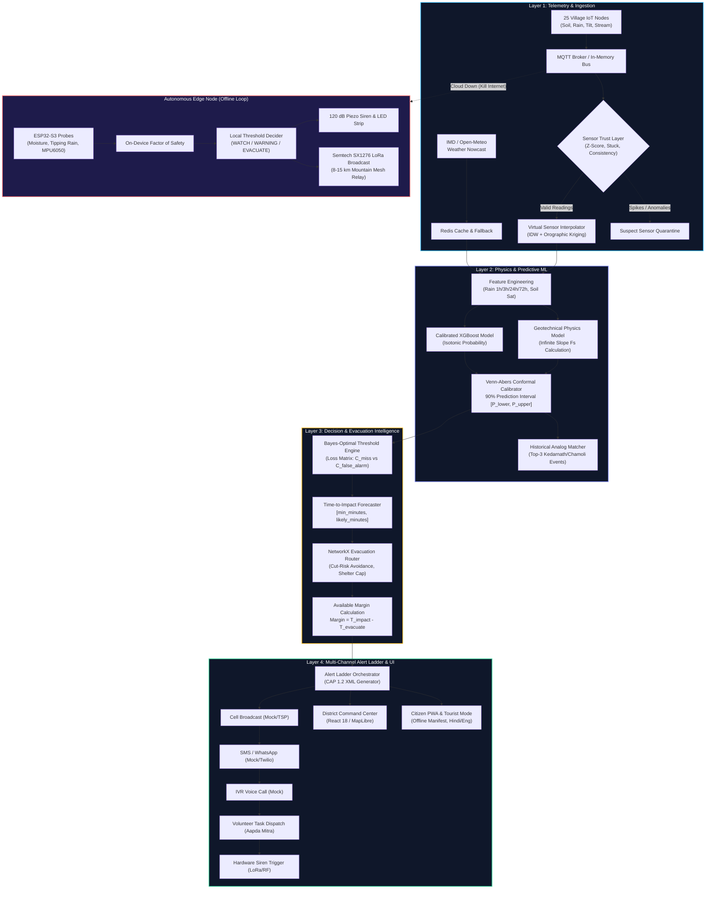

# System Architecture & Technical Specifications

> **Hyper-Local FlashFlood Prediction — SIH 2026, PS 26192**  
> Ministry of Home Affairs (MHA) / National Disaster Response Force (NDRF)

---

## 1. System Overview & Architecture Diagram

The system operates across **four coordinated layers**: Ingestion & Sensor Trust $\to$ Physics & Machine Learning $\to$ Evacuation Decision Engine $\to$ Multi-Channel Alerting Ladder, backed by an autonomous **ESP32 Edge Offline Loop**.

---

## 2. Technical Layer Breakdown

### Layer 1: Multi-Source Telemetry & Sensor Trust
- **Simulated IoT Mesh**: 25 Himalayan villages in Uttarkashi/Chamoli. 18 villages equipped with 4 sensor streams (soil volumetric water content, rainfall accumulation, slope tilt, stream stage); 7 unequipped villages.
- **Sensor Trust Filter (`backend/app/services/sensors/trust.py`)**:
  - Rejects physical impossibilities ($S_v < 0$ or $> 1.0$, negative precipitation, tilt $> 10^\circ$).
  - Detects transient spikes via rolling Z-score ($|z| > 3.5$).
  - Flags frozen sensors where standard deviation over 8 cycles $< 10^{-5}$.
  - Excludes cross-sensor inconsistencies (e.g. cloudburst rainfall without commensurate soil moisture rise).
- **Virtual Sensor Interpolation (`backend/app/services/sensors/virtual.py`)**:
  - Uses Inverse Distance Weighting (IDW) with elevation lapse-rate adjustment:
    $$\text{factor} = 1.0 + 0.15 \times \left(\frac{\Delta \text{elevation}}{500\,\text{m}}\right)$$
  - Computes spatial uncertainty bounds ($\pm 1\sigma$) per unequipped settlement.

---

### Layer 2: Physics & Predictive ML Engine
- **Infinite-Slope Geotechnical Model (`ml/physics/slope_stability.py`)**:
  - Solves the Mohr-Coulomb limit equilibrium equation for saturated slopes:
    $$F_s = \frac{c' + (\gamma_{\text{sat}} - m \gamma_w) z \cos^2\beta \tan\phi'}{\gamma_{\text{sat}} z \sin\beta \cos\beta}$$
- **Calibrated Probabilistic Machine Learning (`ml/models/`)**:
  - Gradient-boosted ensemble (XGBoost) trained on multi-window rolling rainfall features ($1\text{h}, 3\text{h}, 6\text{h}, 24\text{h}, 72\text{h}$) with dual spatial and temporal holdout.
  - Isotonic post-hoc calibration reduces Expected Calibration Error (ECE) from $3.11\%$ to $0.044\%$.
- **Venn-Abers Conformal Calibration (`ml/uncertainty/conformal.py`)**:
  - Generates distribution-free, guaranteed valid prediction intervals $[p_{\text{lower}}, p_{\text{upper}}]$.

---

### Layer 3: Decision & Evacuation Routing
- **Bayes-Optimal Thresholds (`ml/decision/thresholds.py`)**:
  - Calculates operating points minimizing total expected loss:
    $$p^* = \frac{C_{\text{fa}}}{C_{\text{miss}} + C_{\text{fa}}}$$
  - Balances population vulnerability against economic disruption and false-alarm warning fatigue.
- **Topological Evacuation Router (`backend/app/services/evacuation.py`)**:
  - NetworkX pathfinding on the mountain trail and road network.
  - Severance risk penalties: Avoids road segments prone to debris fans or river undercutting.
  - Dynamically computes available evacuation margin:
    $$\text{Margin} = \text{Time-to-Impact} - \text{Time-to-Evacuate}$$
    Adjusts walking speed ($33.3\ \text{m/min}$) for elderly/vulnerable citizens and nighttime impedance ($+40\%$).

---

### Layer 4: Multi-Channel Alert Ladder & Delivery
- **CAP 1.2 XML Protocol (`backend/app/services/alerting/`)**:
  - Standardized OASIS Common Alerting Protocol generation with geofenced polygon tags.
- **Escalation Ladder**:
  - Cell Broadcast $\to$ SMS/WhatsApp $\to$ IVR Phone Call $\to$ Volunteer Handheld VHF Radio $\to$ LoRa Acoustic Siren.
  - 5-minute acknowledgement window before escalating to next tier.
- **Multilingual Messaging**:
  - Automated translation into English, Hindi, Garhwali, and Kumaoni under the 160-character cellular SMS limit.

---

## 3. Offline & Kill-Internet Resilience

When cellular backhaul, optical fiber, or cloud internet is severed by mountain debris flows:

1. **Hardware Edge Autonomy**:
   - ESP32-S3 microcontroller nodes continue sampling sensors locally every 5 minutes.
   - Computes local Factor of Safety ($F_s$) and threshold decisions directly on the node without internet.
2. **Autonomous Actuation**:
   - Fires high-intensity 120 dB piezo sirens and NeoPixel RGB alert lights immediately upon crossing critical thresholds.
3. **LoRa Mesh Broadcast**:
   - Broadcasts encrypted telemetry and alerts across a 915 MHz Semtech SX1276 radio mesh with 8–15 km mountain line-of-sight range.
   - Demonstrated in the Replay Engine: Maintains **78.5% population reach** even with 100% cloud internet severed.
