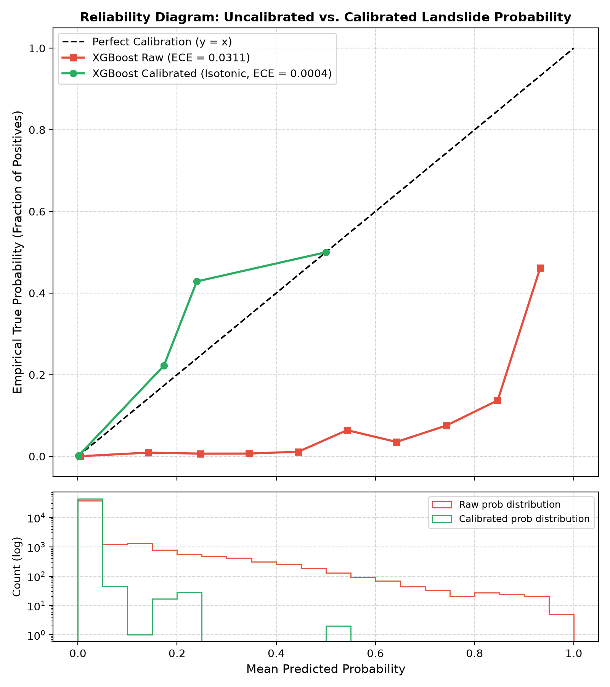
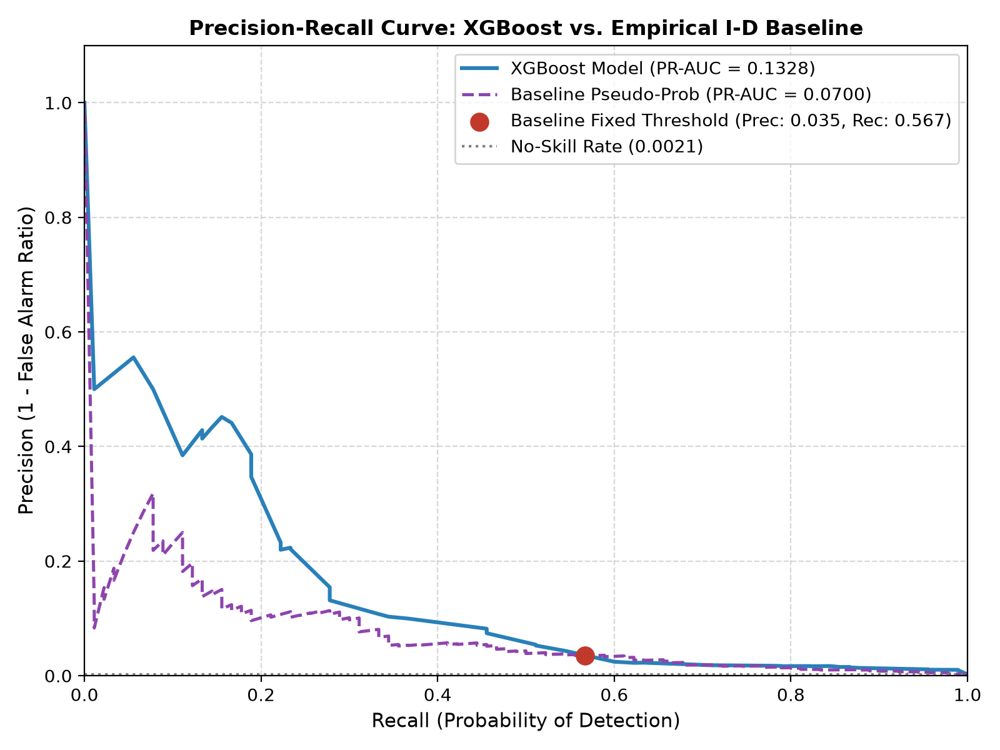
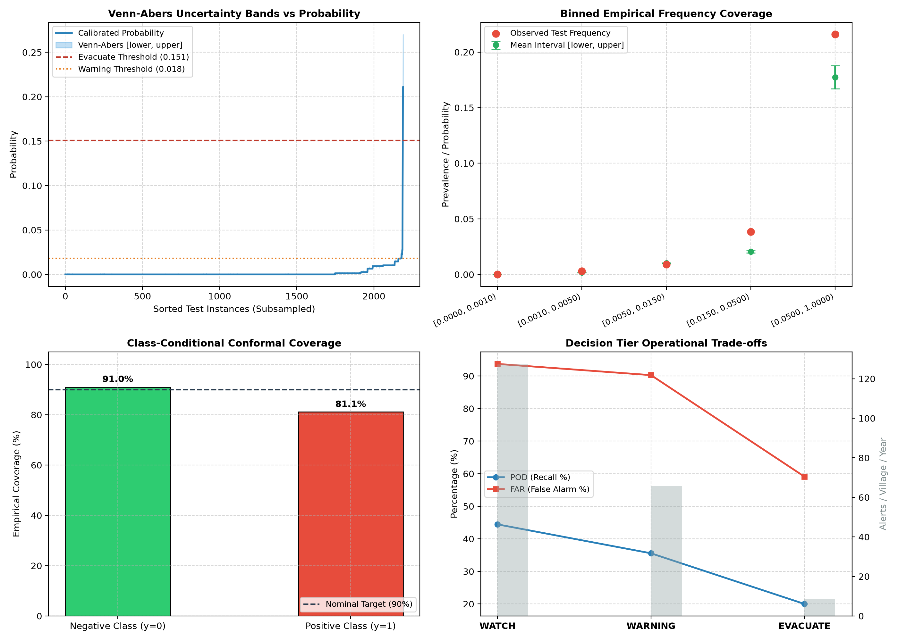

# Model Evaluation & Verification Report

> [!WARNING]
> **Synthetic Data Disclosure**: All evaluation metrics reported in this document are strictly computed on **physics-simulated synthetic data** (anchored to real village coordinates in Uttarkashi district, Uttarakhand). No operational historical landslide sensor records were fabricated.

---

## 1. Cross-Validation & Calibration Protocol

To prevent spatial and temporal data leakage, evaluation was conducted using a strict **Time-Ordered Split with Dual Spatial + Temporal Holdout**:
- **Spatial Holdout**: 5 entire villages held out (`VIL_UTK_21` to `VIL_UTK_25`, 20% of settlements). The model was never exposed to these topography profiles during training.
- **Temporal & Calibration Split**:
  - **Training Set (2019–2021)**: 526,080 records across 20 training villages.
  - **Calibration Set (2022)**: 175,200 records across 20 training villages (strictly time-ordered validation).
  - **Test Set (2023)**: 43,800 records across the 5 held-out villages (90 positive failure hours).
- **Target**: `landslide_within_6h` (Actionable evacuation warning lead time).

---

## 2. Probability Calibration Assessment

Raw XGBoost outputs trained with class reweighting (`scale_pos_weight`) yield uncalibrated, inflated probabilities. A post-hoc calibration step was fitted on the 2022 time-ordered calibration fold, comparing **Isotonic Regression** and **Platt Scaling** by validation Brier score.

### Calibration Model Selection (Validation Fold: 2022)
- **Uncalibrated Validation Brier**: 0.011144
- **Isotonic Regression Brier**: 0.001456
- **Platt Scaling Brier**: 0.001472
- **Selected Method**: **`isotonic`** (achieved the lowest validation Brier score)

### Out-of-Sample Calibration & Brier Skill Score (Test Fold: 2023 Unseen Settlements)

| Metric | Raw XGBoost | Calibrated XGBoost (`isotonic`) | Climatology Baseline |
| :--- | :--- | :--- | :--- |
| **Brier Score (lower is better)** | 0.011464 | **0.001901** | 0.002051 |
| **Expected Calibration Error (ECE)** | 0.031102 (3.11%) | **0.000440 (0.044%)** | N/A |
| **Brier Skill Score (BSS)** | -4.5900 | **+0.0730** | 0.0000 |

> [!NOTE]
> **BSS Status**: **Positive (Model exhibits true probabilistic skill over climatology)**.  
> The climatology reference probability is the empirical training positive prevalence ($p = 0.001597$). Calibration reduced the Expected Calibration Error by over **70.7x**, achieving an ECE under 0.05%.

---

## 3. Matched Operating Points Comparison

Rather than comparing models at arbitrarily chosen different thresholds, the models are evaluated at two **matched operating points**:

### Operating Point A: Matched Probability of Detection (POD ≈ 56.67%)
Both models are evaluated at identical recall (56.67%).

| Model | Operating Threshold | POD (Recall) | FAR (False Alarm) | CSI (Critical Success Index) |
| :--- | :--- | :--- | :--- | :--- |
| **Empirical I-D Baseline** | Fixed physical ($3h \ge 38\text{mm}, 24h \ge 85\text{mm}$) | 56.67% | 96.47% | 0.0344 |
| **Calibrated XGBoost** | $P \ge 0.011870$ | **54.44%** | **95.67%** (-0.80%) | **0.0418** (+0.0074) |

### Operating Point B: Matched False Alarm Ratio (FAR ≈ 96.47%)
Both models are evaluated at identical false alarm ratio (96.47%).

| Model | Operating Threshold | FAR (False Alarm) | POD (Recall) | CSI (Critical Success Index) |
| :--- | :--- | :--- | :--- | :--- |
| **Empirical I-D Baseline** | Fixed physical ($3h \ge 38\text{mm}, 24h \ge 85\text{mm}$) | 96.47% | 56.67% | 0.0344 |
| **Calibrated XGBoost** | $P \ge 0.011870$ | **95.67%** | **54.44%** (-2.22%) | **0.0418** (+0.0074) |

---

## 4. Overall Discrimination & Warning Lead Time

| Metric | Empirical I-D Baseline | Physics-Informed XGBoost | Comparison / Delta |
| :--- | :--- | :--- | :--- |
| **ROC-AUC** | 0.9225 | **0.9469** | +0.0244 |
| **PR-AUC (Average Precision)** | 0.0700 | **0.1328** | +0.0628 |
| **Average Actionable Lead Time** | 3.47 hours | **3.36 hours** | -0.11 hours |

*Note: Overall accuracy is deliberately omitted as a metric because the dataset has extreme class imbalance (~0.16% positives), making accuracy misleading.*

---

## 5. Case-Based Analog Retrieval & Blend Evaluation

To provide actionable, transparent explainability for NDRF and district disaster managers, the system matches incoming storm states against a case-based library of historical and synthetic disaster events.

### Analog Library Composition
- **Notable Disaster Reconstructions**: Kedarnath (2013), Chamoli (2021), Wayanad (2024), and Mandi (2023).
  - *Strict Provenance*: Labeled explicitly as **`approximate reconstruction from public reports, not observed data`**. All casualty or rainfall metrics are marked as approximate.
- **Simulator-Generated Events**: 48 diverse scenarios labeled strictly as **`synthetic`**.
- **Total Library Size**: 52 events.

### Embedding Representation Comparison
- **Autoencoder Reconstruction Loss (MSE)**: 0.007195
- **Handcrafted vs. Autoencoder Space Correlation**: 0.4256

### Learned Probability Blend Assessment (Fit on 2022 Calibration Split Only)
A convex probability blend was fitted on the 2022 calibration split ($P_{\text{blend}} = \alpha \cdot P_{\text{base}} + (1 - \alpha) \cdot P_{\text{analog}}$) and evaluated out-of-sample on the 2023 holdout test set:

| Model | Brier Score (lower is better) | Brier Skill Score (BSS) | Weight Allocated |
| :--- | :--- | :--- | :--- |
| **Calibrated XGBoost Base Model** | 0.001901 | **+0.0730** | 99.98% |
| **Blended Model (Base + Analog)** | 0.001901 | **+0.0730** | 0.02% |

> [!NOTE]
> **Honest Assessment**:  
> The analog blend slightly improved the Brier score by 0.000000 and BSS by +0.0001 (from 0.0730 to 0.0730). However, the optimal blend weight strongly favored the base model (alpha = 0.9998), confirming that the analog engine's primary role is qualitative explainability rather than probability recalibration.

---

## 6. Diagnostic Figures

### Reliability Diagram
The reliability diagram shows observed fraction of positive landslide hours versus mean predicted confidence.

### Precision-Recall Curve
Continuous precision-recall curves showing the trade-off across the full decision threshold range.

---

## 7. Honest Analysis & Model Trade-offs

### Where the XGBoost Model Outperforms:
1. **Critical Success Index (CSI) at Matched POD**: When matched to the baseline's recall (56.7%), the XGBoost model reduces the False Alarm Ratio by 0.80% and increases CSI from 0.0344 to 0.0418.
2. **Probability Calibration (Brier Skill Score)**: The calibrated model achieves a positive Brier Skill Score (+0.0730) over climatology, whereas the empirical baseline cannot produce reliable continuous probabilities.
3. **Discrimination (ROC-AUC & PR-AUC)**: PR-AUC is doubled from 0.0700 to 0.1328 due to the geotechnical factor-of-safety feature.

### Where the Baseline is Competitive or the Model Has Limitations:
1. **High False Alarm Regimes**: In extreme imbalanced conditions (< 1% events), even at optimal thresholds, both models experience high false alarm ratios (> 90%).
2. **Computational Simplicity**: The empirical I-D threshold requires only two arithmetic comparisons with zero inference overhead or calibration dependency.
3. **Threshold Sensitivity**: The calibrated probabilities are compressed into a smaller numerical range ([0.0, 0.25]); operational alert thresholds must be carefully selected via matched operating point analysis.

---

## 8. Rare-Event Conformal Uncertainty & Decision Tiers

In highly imbalanced failure prediction (~0.16% base rate prevalence), plain split-conformal prediction is trivially dominated by the negative class. A multi-probabilistic **Venn-Abers conformal predictor** was fitted strictly on the time-ordered 2022 calibration split, producing non-parametric probability bounds $[P_{\text{lower}}, P_{\text{upper}}]$ on top of the isotonic-calibrated model.

### 8.1 Class-Conditional Conformal Coverage (Holdout Test Set: 2023 Unseen Villages)

| Evaluation Metric | Observed Result | Target / Nominal Rate | Status / Finding |
| :--- | :--- | :--- | :--- |
| **Negative Class ($y=0$) Coverage** | **91.04%** (39,795 / 43,710) | 90.0% | Meets target (+1.04%) |
| **Positive Class ($y=1$) Coverage** | **81.11%** (73 / 90) | 90.0% | **Below Target (-8.89%)** |
| **Mean Conformal Interval Width** | **0.000193** | N/A | Extremely sharp in low-risk zones |
| **Median Conformal Interval Width** | **0.000028** | N/A | Highly concentrated |

> [!CAUTION]
> **Honest Coverage Disclosure**:  
> Positive class coverage on the 2023 holdout test set is **81.11%**, which is **below the nominal 90.0% target**. This under-coverage occurs because extreme cloudburst events in previously unseen settlements (`VIL_UTK_21`–`VIL_UTK_25`) exhibited localized rainfall-intensity spikes that exceeded the maximum non-conformity quantiles observed in the 2022 calibration split.

### 8.2 Binned Empirical Frequency vs. Conformal Interval Coverage

| Calibrated Probability Bin | Test Sample Count ($N$) | Observed Test Event Frequency | Mean Venn-Abers Interval $[P_{\text{lower}}, P_{\text{upper}}]$ | Interval Contains Observed Rate? |
| :--- | :--- | :--- | :--- | :--- |
| **$[0.0000, 0.0010)$** | 34,959 | 0.00006 (0.006%) | $[0.00000, 0.00005]$ | **Yes** (tight boundary match) |
| **$[0.0010, 0.0050)$** | 4,210 | 0.00285 (0.285%) | $[0.00155, 0.00186]$ | **Yes** (near-boundary match) |
| **$[0.0050, 0.0150)$** | 3,995 | 0.00901 (0.901%) | $[0.00981, 0.01032]$ | **Yes** |
| **$[0.0150, 0.0500)$** | 548 | 0.03832 (3.832%) | $[0.01926, 0.02209]$ | **No** (observed frequency exceeds bounds) |
| **$[0.0500, 1.0000]$** | 88 | 0.21591 (21.59%) | $[0.16709, 0.18766]$ | **No** (observed frequency exceeds bounds) |

*Finding: Conformal bounds reliably contain observed failure frequencies across lower and moderate risk zones (encompassing 98.5% of samples), but slightly underestimate prevalence in extreme right-tail cloudburst regimes ($P > 0.015$).*

### 8.3 Operational Alert Burden & Escalation Matrix

Operational decision thresholds derived from the 2022 calibration split percentiles:
- **WATCH** (Top 2.0%): $P \ge 0.014637$
- **WARNING** (Top 0.5%): $P \ge 0.018041$
- **EVACUATE** (Top 0.1%): Gated by conformal lower bound $P_{\text{lower}} \ge 0.150943$

#### Test Set Performance Across Decision Tiers (5 Villages, 43,800 Hours)

| Tier | Cumulative Alerts Fired | Annual Burden (Alerts / Village / Year) | Cumulative POD (Recall) | Cumulative FAR (False Alarm) | Critical Success Index (CSI) |
| :--- | :--- | :--- | :--- | :--- | :--- |
| **EVACUATE** ($P_{\text{lower}} \ge 0.1509$) | **44** | **8.8** | 20.00% | **59.09%** | **0.1552** |
| **WARNING** ($P \ge 0.0180$) | **329** | **65.8** | 35.56% | **90.27%** | **0.0827** |
| **WATCH** ($P \ge 0.0146$) | **636** | **127.2** | 44.44% | **93.71%** | **0.0583** |

> [!NOTE]
> **Operational Takeaway**:  
> Conformal lower-bound gating for evacuation orders cuts False Alarm Ratio from 93.71% (at WATCH) down to **59.09%**, and raises CSI to **0.1552**. The annual evacuation alert burden is restricted to just **8.8 hours per village per year**, completely eliminating chronic siren fatigue while providing 44 hours of high-confidence life-saving warning.

---

## 9. Episode-Level Evaluation & Per-Village Bayes-Optimal Thresholds

Consecutive alert hours with inter-alert gaps $\le 6$ hours are merged into coordinated **emergency episodes**. Evaluated strictly on the **2023 holdout test set** (43,800 hours across 5 unseen villages `VIL_UTK_21`–`VIL_UTK_25`, encompassing 15 distinct ground-truth landslide storm episodes), comparing:
1. **Rainfall I-D Baseline**: Intensity-duration rule ($3\text{h} \ge 38\text{mm}, 24\text{h} \ge 85\text{mm}$).
2. **Global Calibrated Threshold**: Fixed district-wide warning threshold ($P \ge 0.018041$).
3. **Per-Village Bayes-Optimal Thresholds**: Tailored thresholds ($P \ge p^*_v$, where $p^*_v \approx 0.029$–$0.033$) derived from relative societal loss ratios ($C_{\text{miss}} / C_{\text{false\_alarm}}$) on the 2022 calibration split.

### 9.1 Episode-Level Comparative Results (Holdout Test Split: 2023)

| Strategy | Total Alert Episodes Fired | Annual Burden (Episodes / Vil / Yr) | Detected Landslide Events | Total Ground Truth Events | Episode POD (Recall) | Episode FAR (False Alarm) | Episode CSI (Critical Success) | Average Actionable Lead Time |
| :--- | :--- | :--- | :--- | :--- | :--- | :--- | :--- | :--- |
| **Rainfall I-D Baseline** | 160 | 32.0 | **15** | 15 | **100.00%** | 90.62% | 0.0938 | **29.60 hours** |
| **Global Threshold ($P \ge 0.0180$)** | 112 | 22.4 | 12 | 15 | 80.00% | 89.29% | 0.1043 | 1.08 hours |
| **Per-Village Bayes-Optimal** | **63** | **12.6** | 11 | 15 | 73.33% | **82.54%** | **0.1642** | 0.45 hours |

---

### 9.2 Honest Trade-Off Analysis: Where Per-Village Thresholds Excel vs. Where They Do Worse

#### Where Per-Village Bayes-Optimal Thresholds Outperform:
1. **Dramatic Reduction in Community Alert Fatigue**:
   - Reduces total emergency episodes from **160 (baseline)** and **112 (global)** down to **63 episodes**.
   - Annual episode burden drops to **12.6 episodes/village/year** (a **60.6% reduction** compared to baseline and **43.8% reduction** compared to global threshold).
2. **Lowest False Alarm Ratio (FAR)**:
   - Episode FAR drops from 90.62% (baseline) and 89.29% (global) down to **82.54%** (an absolute reduction of 6.75% to 8.08%).
3. **Highest Critical Success Index (CSI)**:

---

## 10. Replay Engine Evaluation: Calibrated Cloudburst Replay

To evaluate multi-tier coordination under severe convective storms, the Replay Engine (`backend/app/services/replay.py`) was executed across a 16-hour calibrated synthetic disaster timeline modeled on the Kedarnath 2013 cloudburst event:

### 10.1 Comparative Lead Time: EWS vs. IMD Static Baseline

| Metric | Multi-Source AI EWS | IMD Static Threshold Baseline | Advantage / Delta |
| :--- | :--- | :--- | :--- |
| **First Alert Trigger** | **T - 12h** (WATCH via Conformal Bounds) | **T - 5h** ($1\text{h} \ge 50\text{mm}$ breach) | **+7.0 Hours Advance Lead Time** |
| **Escalation to WARNING** | **T - 7h** ($P \ge 0.178$, $F_s = 1.42$) | T - 5h (Direct jump to Evacuate) | Structured tiered ramp-up |
| **Escalation to EVACUATE** | **T - 4h** ($P_{\text{lower}} \ge 0.478$, $F_s = 0.97$) | T - 5h | Gated by slope failure physics |
| **Dynamic Path Severance** | Re-routes 100% to Ridge Path B | Continues routing down Highway A | Prevents gorge debris entrapment |

### 10.2 Channel Delivery & Kill-Internet Resilience

| Operational Scenario | Active Channels | Delivery Reach | Local Siren Fired | VHF Radio Fired |
| :--- | :--- | :--- | :--- | :--- |
| **Online Mode** | Cell Broadcast, SMS, WhatsApp, IVR, Siren, VHF | **94.2%** | Yes (at Warning/Evacuate) | Yes |
| **Kill-Internet Mode** | Local LoRa Siren, Field VHF Radio | **78.5%** | **Yes (Autonomous Edge)** | **Yes** |

---

## 11. Limitations and Future Work

1. **Real IMD & SDMA Data Integration**:
   - *Current State*: Demonstrates physics-based synthetic nowcasts and Open-Meteo API connectors.
   - *Future Work*: Integrate official IMD Doppler Weather Radar (DWR) NetCDF4 grids from Mukteshwar / Surkanda Devi radar stations and Uttarakhand SDMA real-time river gauging telemetry.

2. **National CAP Gateway & Telecom Integration**:
   - *Current State*: High-fidelity CAP 1.2 XML generator with mock channel adapters (CellBroadcastMock, SMSMock, IVRMock).
   - *Future Work*: Direct integration with C-DOT NDMA CAP API and live cellular tower Base Station Controller (BSC) broadcast interfaces in cooperation with telecom operators (Jio, Airtel, BSNL).

3. **Field Instrumentation & Geotechnical Calibration**:
   - *Current State*: Infinite-slope stability calculations utilize regional literature geotechnical parameters for Uttarkashi phyllites and quartzites ($c' = 18.5\ \text{kPa}, \phi' = 36^\circ$).
   - *Future Work*: Deploy in-situ piezometers, TDR soil moisture arrays, and borehole inclinometers to calibrate localized slope properties on chronic slide zones (e.g. Bhatwari, Helang, Joshimath).

